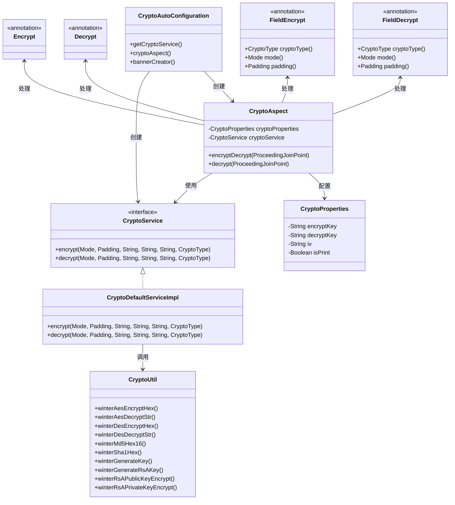
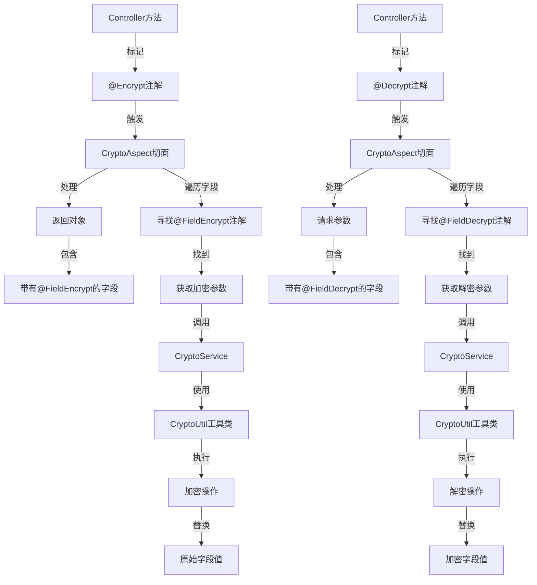

# 🌨️ winter-encrypt-spring-boot-starter

<div align="center">

[](https://www.apache.org/licenses/LICENSE-2.0.html)
[](https://openjdk.java.net/)
[](https://spring.io/projects/spring-boot)
[](https://search.maven.org/artifact/io.github.hahaha-zsq/winter-encrypt-spring-boot-starter)
[](https://github.com/hahaha-zsq/winter-encrypt-spring-boot-starter)

</div>

> 🔐 一个开箱即用的 Spring Boot 加解密工具包，内置常用对称/非对称加密算法，支持注解式加解密，助力数据安全！

<p align="center">
  
  
  
  
</p>

## 📚 目录

- [✨ 特性亮点](#-特性亮点)
- [🏗️ 架构设计](#️-架构设计)
- [📦 快速开始](#-快速开始)
- [⚙️ 配置项说明](#️-配置项说明)
- [🏷️ 注解说明](#️-注解说明)
- [🚦 使用示例](#-使用示例)
- [🛠️ 进阶用法](#️-进阶用法)
- [🧰 工具类方法](#-工具类方法)
- [❓ 常见问题](#-常见问题)
- [🔗 相关链接](#-相关链接)
- [📄 更新日志](#-更新日志)
- [👥 贡献指南](#-贡献指南)
- [🔒 安全说明](#-安全说明)
- [📝 开源协议](#-开源协议)

---

## ✨ 特性亮点

- 🚀 **零配置自动装配**，即插即用
- 🔒 支持 **AES/DES** 等主流加密算法
- 🏷️ 注解驱动，**@Encrypt/@Decrypt/@FieldEncrypt/@FieldDecrypt** 一键加解密
- 🛡️ 支持字段级加密解密，灵活可扩展
- 📦 兼容 Spring Boot 2.x
- 📄 丰富的配置项，支持自定义实现
- 🔧 内置多种加密模式（ECB、CBC、CFB、OFB、CTR）
- 📝 支持多种填充方式（PKCS5Padding、NoPadding等）
- 🔍 详细的文档和示例代码

---

## 🏗️ 架构设计

下图展示了项目的核心类和它们之间的关系：



---

## 📦 快速开始

### 1️⃣ 引入依赖

```xml
<dependency>
    <groupId>io.github.hahaha-zsq</groupId>
    <artifactId>winter-encrypt-spring-boot-starter</artifactId>
    <version>0.0.31</version>
</dependency>
```

### 2️⃣ 配置 application.yml

```yaml
winter-crypto:
  encrypt-key: "your-encrypt-key"   # 加密密钥
  decrypt-key: "your-decrypt-key"   # 解密密钥
  iv: "your-iv"                     # 偏移量（如CBC模式必填）
  is-print: true                    # 是否打印banner（可选）
```

### 3️⃣ 开始使用

只需在需要加密的方法上添加 `@Encrypt` 注解，并在相应字段上添加 `@FieldEncrypt` 注解即可：

```java
@RestController
public class DemoController {
    
    @Encrypt
    @GetMapping("/data")
    public Result<UserVO> getData() {
        // 业务逻辑
        return Result.ok(userVO); // 返回时自动加密标记的字段
    }
}
```

---

## ⚙️ 配置项说明

| 配置项 | 说明 | 是否必填 | 默认值 |
|-------|------|---------|-------|
| `winter-crypto.encrypt-key` | 加密密钥 | ✅ | - |
| `winter-crypto.decrypt-key` | 解密密钥 | ✅ | - |
| `winter-crypto.iv` | 偏移量 | ✅ | - |
| `winter-crypto.is-print` | 是否打印banner | ❌ | true |

> ⚠️ **注意**：使用CBC等模式时，必须提供偏移量(iv)

---

## 🏷️ 注解说明

### 核心注解

| 注解 | 作用范围 | 主要功能 | 典型用法 |
|------|----------|----------|----------|
| `@Encrypt` | 方法级别 | 触发加密流程，拦截返回对象 | Controller方法 |
| `@Decrypt` | 方法级别 | 触发解密流程，拦截方法参数 | Controller方法 |
| `@FieldEncrypt` | 字段级别 | 指定字段加密及加密策略 | VO字段 |
| `@FieldDecrypt` | 字段级别 | 指定字段解密及解密策略 | DTO字段 |

### 注解参数说明

#### @FieldEncrypt / @FieldDecrypt 参数

| 参数 | 类型 | 默认值 | 说明 |
|------|------|--------|------|
| `cryptoType` | `CryptoType` | `AES` | 加密算法类型（AES/DES） |
| `mode` | `Mode` | `CBC` | 加密模式（ECB/CBC/CFB/OFB/CTR） |
| `padding` | `Padding` | `PKCS5Padding` | 填充方式 |

### 工作原理

下图展示了加密解密注解的工作流程：



---

## 🚦 使用示例

### 🔒 加密示例

#### 1. DTO 示例

```java
@Data
public class Result<T> {
    // 状态码
    private Integer code;
    // 信息
    private String message;
    // 数据 - 使用@FieldEncrypt标记需要加密的字段
    @FieldEncrypt(mode = Mode.CBC)
    private T data;
    
    // 构造方法和其他业务方法...
}
```

#### 2. Controller 示例

```java
@Encrypt  // 标记此方法的返回值需要进行加密处理
@PostMapping("/getPagingRoleInfoByConditions")
public Result<?> getPagingRoleInfoByConditions(@RequestBody @Validated({SysRoleDTO.Query.class}) SysRoleDTO roleDto) {
    return sysRoleService.getPagingRoleInfoByConditions(roleDto);
}
```

#### 3. 配置文件示例

```yaml
winter-crypto:
  decrypt-key: 346a3f9f4c1988cb7a507cc177923ac7
  encrypt-key: 346a3f9f4c1988cb7a507cc177923ac7
  iv: 1234567887654321
```


### 🔓 解密示例

#### 1. 请求对象示例

```java
@Data
public class UserRequest {
    private String username;

    @FieldDecrypt(padding = Padding.ISO10126Padding, mode = Mode.CBC)
    private String password;

    @FieldDecrypt(padding = Padding.ISO10126Padding, mode = Mode.CBC)
    private String idCard;
}
```

#### 2. Controller 示例

```java
@Decrypt  // 标记此方法的参数需要进行解密处理
@PostMapping("/demo")
public String demo(@RequestBody UserRequest request) {
    // 请求中的password和idCard字段已经被自动解密
    System.out.println("解密后的密码: " + request.getPassword());
    System.out.println("解密后的身份证: " + request.getIdCard());
    return "解密后的密码: " + request.getPassword() + "   " + "解密后的身份证: " + request.getIdCard();
}
```


---

## 🛠️ 进阶用法

### 自定义加密实现

只需实现 `CryptoService` 接口，并注入为 Spring Bean，即可覆盖默认加解密逻辑：

```java
@Component
public class CustomCryptoServiceImpl implements CryptoService {
    @Override
    public String encrypt(Mode mode, Padding padding, String content, String key, String iv, CryptoType type) {
        // 自定义加密逻辑
        return yourEncryptLogic(content, key, iv);
    }

    @Override
    public String decrypt(Mode mode, Padding padding, String content, String key, String iv, CryptoType type) {
        // 自定义解密逻辑
        return yourDecryptLogic(content, key, iv);
    }
}
```

---

## 🧰 工具类方法

`CryptoUtil` 工具类内置了多种加解密、摘要、密钥生成等静态方法，便于开发者灵活调用：

<details>
<summary>📋 查看完整工具方法列表</summary>

| 方法名 | 说明 | 示例 |
|--------|------|------|
| `winterAesEncryptHex` | AES加密（支持多种模式/填充） | `CryptoUtil.winterAesEncryptHex(mode, padding, key, iv, content)` |
| `winterAesDecryptStr` | AES解密 | `CryptoUtil.winterAesDecryptStr(mode, padding, key, iv, content)` |
| `winterDesEncryptHex` | DES加密 | `CryptoUtil.winterDesEncryptHex(mode, padding, key, iv, content)` |
| `winterDesDecryptStr` | DES解密 | `CryptoUtil.winterDesDecryptStr(mode, padding, key, iv, content)` |
| `winterMd5Hex16` | 16位MD5摘要 | `CryptoUtil.winterMd5Hex16(content)` |
| `winterSha1Hex` | SHA1摘要 | `CryptoUtil.winterSha1Hex(content)` |
| `winterGenerateKey` | 随机生成AES密钥 | `CryptoUtil.winterGenerateKey()` |
| `winterGenerateRsAKey` | 生成RSA公私钥对 | `CryptoUtil.winterGenerateRsAKey()` |
| `winterRsAPublicKeyEncrypt` | RSA公钥加密 | `CryptoUtil.winterRsAPublicKeyEncrypt(privateKey, publicKey, content)` |
| `winterRsAPrivateKeyEncrypt` | RSA私钥加密 | `CryptoUtil.winterRsAPrivateKeyEncrypt(privateKey, publicKey, content)` |
| `winterRsAPrivateKeyDecrypt` | RSA私钥解密 | `CryptoUtil.winterRsAPrivateKeyDecrypt(privateKey, publicKey, encrypted)` |
| `winterRsAPublicKeyDecrypt` | RSA公钥解密 | `CryptoUtil.winterRsAPublicKeyDecrypt(privateKey, publicKey, encrypted)` |
| `winterMd5withRsaSign` | MD5withRSA数字签名 | `CryptoUtil.winterMd5withRsaSign(privateKey, publicKey, content)` |
| `winterMd5withRsaVerify` | 验证MD5withRSA签名 | `CryptoUtil.winterMd5withRsaVerify(privateKey, publicKey, signData, content)` |

</details>

### 示例：AES加密解密

```java
// 生成随机密钥
byte[] key = CryptoUtil.winterGenerateKey();
String iv = "abcdef1234567890";
String content = "hello world";

// 加密
String encrypted = CryptoUtil.winterAesEncryptHex(
    Mode.CBC, 
    Padding.PKCS5Padding, 
    key, 
    iv.getBytes(), 
    content
);

// 解密
String decrypted = CryptoUtil.winterAesDecryptStr(
    Mode.CBC, 
    Padding.PKCS5Padding, 
    key, 
    iv.getBytes(), 
    encrypted
);
```

### 示例：生成RSA密钥对

```java
Map<String, String> keyMap = CryptoUtil.winterGenerateRsAKey();
String privateKey = keyMap.get("privateKey");
String publicKey = keyMap.get("publicKey");
```

---

## ❓ 常见问题

<details>
<summary><b>@Encrypt 和 @FieldEncrypt 有什么联系？</b></summary>

| 注解 | 作用范围 | 主要功能 | 典型用法 |
|------|----------|----------|----------|
| `@Encrypt` | 方法级别 | 触发加密流程，拦截返回对象 | Controller方法 |
| `@FieldEncrypt` | 字段级别 | 指定字段加密及加密策略 | DTO/VO字段 |

- `@Encrypt` 用于方法上，AOP切面拦截后会遍历返回对象的所有字段
- 只有被 `@FieldEncrypt` 标记的字段才会被加密，未标记字段保持原样
- `@FieldEncrypt` 可自定义加密类型、模式、填充方式，实现细粒度加密控制

**示例流程：**
1. Controller方法加 `@Encrypt`，返回对象中有 `@FieldEncrypt` 字段
2. 返回时自动对这些字段加密，其他字段不变
</details>

<details>
<summary><b>启动报缺少密钥/iv？</b></summary>

请检查 `application.yml` 配置项是否齐全。确保以下配置项都已正确设置：

```yaml
winter-crypto:
  encrypt-key: "your-encrypt-key"   # 必填
  decrypt-key: "your-decrypt-key"   # 必填
  iv: "your-iv"                     # 必填
```
</details>

<details>
<summary><b>如何自定义加密算法？</b></summary>

实现 `CryptoService` 接口并注入Spring容器即可：

```java
@Component
public class CustomCryptoServiceImpl implements CryptoService {
    // 实现加密方法
    @Override
    public String encrypt(Mode mode, Padding padding, String content, String key, String iv, CryptoType type) {
        // 自定义加密逻辑
        return yourEncryptImplementation(content, key, iv);
    }
    
    // 实现解密方法
    @Override
    public String decrypt(Mode mode, Padding padding, String content, String key, String iv, CryptoType type) {
        // 自定义解密逻辑
        return yourDecryptImplementation(content, key, iv);
    }
}
```
</details>

<details>
<summary><b>支持哪些加密模式/填充？</b></summary>

支持 Hutool 的所有 `Mode` 和 `Padding` 枚举：

**Mode 模式：**
- ECB
- CBC
- CFB
- OFB
- CTR

**Padding 填充：**
- NoPadding
- PKCS5Padding
- ISO10126Padding
- ZeroPadding
- ...等
</details>

<details>
<summary><b>前端如何解密数据？</b></summary>

可以使用 `crypto-js` 等库进行前端解密：

```typescript
export const key = "xxxxxx"
export const iv = "xxxxx"

/**
 * 解密AES加密的16进制字符串。
 *
 * @param encryptedHex - 加密后的16进制字符串。
 * @param secretKey - 用于加密/解密的密钥。
 * @param iv - 初始化向量。
 * @param mode - 加密模式
 * @param padding - padding
 * @returns 解密后的明文字符串。
 */
export const decryptAes = (encryptedHex: string, secretKey: string, iv?: string, mode: any = CryptoJS.mode.CBC, padding: any = CryptoJS.pad.Pkcs7): string => {
    // 创建密钥
    const key = CryptoJS.enc.Utf8.parse(secretKey);

    // 如果有初始化向量，则创建IV
    let ivWordArray: CryptoJS.lib.WordArray | undefined;
    if (iv) {
        ivWordArray = CryptoJS.enc.Utf8.parse(iv);
    }
    const encryptedHexStr = CryptoJS.enc.Hex.parse(encryptedHex)
    const data = CryptoJS.enc.Base64.stringify(encryptedHexStr)
    // 解密
    const decryptedBytes = CryptoJS.AES.decrypt(
        data,
        key,
        {
            iv: ivWordArray,
            mode: mode,
            padding: padding
        }
    );

    // 返回解密后的明文
    return decryptedBytes.toString(CryptoJS.enc.Utf8);
}
/**
 * 加密字符串为AES加密的16进制字符串。
 *
 * @param plainText - 需要加密的明文字符串。
 * @param secretKey - 用于加密/解密的密钥。
 * @param iv - 初始化向量。
 * @param mode - 加密模式
 * @param padding - padding
 * @returns 加密后的16进制字符串。
 */
export const encryptAes = (plainText: string, secretKey: string, iv?: string, mode: any = CryptoJS.mode.CBC, padding: any = CryptoJS.pad.Pkcs7): string => {
    // 创建密钥
    const key = CryptoJS.enc.Utf8.parse(secretKey);

    // 如果有初始化向量，则创建IV
    let ivWordArray: CryptoJS.lib.WordArray | undefined;
    if (iv) {
        ivWordArray = CryptoJS.enc.Utf8.parse(iv);
    }

    // 加密
    const encryptedBytes = CryptoJS.AES.encrypt(
        plainText,
        key,
        {
            iv: ivWordArray,
            mode: mode,
            padding: padding
        }
    );

    // 返回加密后的16进制字符串
    return encryptedBytes.ciphertext.toString(CryptoJS.enc.Hex);
}
```
需要注意的是，这个包对于`PKCS7Padding`和`PKCS5Padding`都是使用`CryptoJS.pad.Pkcs7`，下图是这个包的源码解释


</details>

---

## 🔗 相关链接

- [📘 GitHub 仓库](https://github.com/hahaha-zsq/winter-encrypt-spring-boot-starter)
- [📚 Hutool 文档](https://hutool.cn/docs/#/crypto/)
- [🔧 Spring Boot 官方文档](https://spring.io/projects/spring-boot)
- [📦 Maven 中央仓库](https://search.maven.org/artifact/io.github.hahaha-zsq/winter-encrypt-spring-boot-starter)

---

## 📄 更新日志

### v0.0.31 (最新版本)
- ✨ 新增 `@Decrypt` 注解支持，实现请求参数自动解密
- ✨ 新增 `@FieldDecrypt` 注解，支持字段级解密配置
- 📝 完善文档，补充解密功能使用说明
- 🔧 优化切面逻辑，提升性能

### v0.0.1
- 🎉 首次发布
- ✨ 支持 `@Encrypt` 和 `@FieldEncrypt` 注解
- 🔒 集成 AES/DES 加密算法
- 🛡️ 支持多种加密模式和填充方式

---

## 👥 贡献指南

我们欢迎任何形式的贡献，无论是新功能、文档改进还是问题修复！

### 如何贡献

1. Fork 本仓库
2. 创建您的特性分支 (`git checkout -b feature/amazing-feature`)
3. 提交您的更改 (`git commit -m 'Add some amazing feature'`)
4. 推送到分支 (`git push origin feature/amazing-feature`)
5. 打开一个 Pull Request

### 贡献类型

- 🐛 **Bug修复**: 修复现有功能中的问题
- ✨ **新功能**: 添加全新的功能
- 📝 **文档**: 改进文档或添加示例
- 🔧 **优化**: 改进现有功能但不添加新功能
- 🧪 **测试**: 添加或修改测试

---

## 🔒 安全说明

### 密钥管理

- 请妥善保管您的密钥和偏移量，不要硬编码在代码中
- 建议使用配置中心或环境变量等安全方式存储密钥
- 定期更换密钥，提高系统安全性

### 已知限制

- 本工具包提供基础的加解密功能，但不能替代专业的安全审计
- 对于高安全要求场景，建议结合其他安全措施使用

### 安全漏洞报告

如果您发现任何安全漏洞，请直接联系项目维护者，而不是创建公开issue。

---

## 📝 开源协议

本项目采用 [Apache 2.0 许可证](https://www.apache.org/licenses/LICENSE-2.0.html) 进行许可。

---

<div align="center">

❤️ 欢迎 Star & PR，更多特性敬请期待！

</div>
