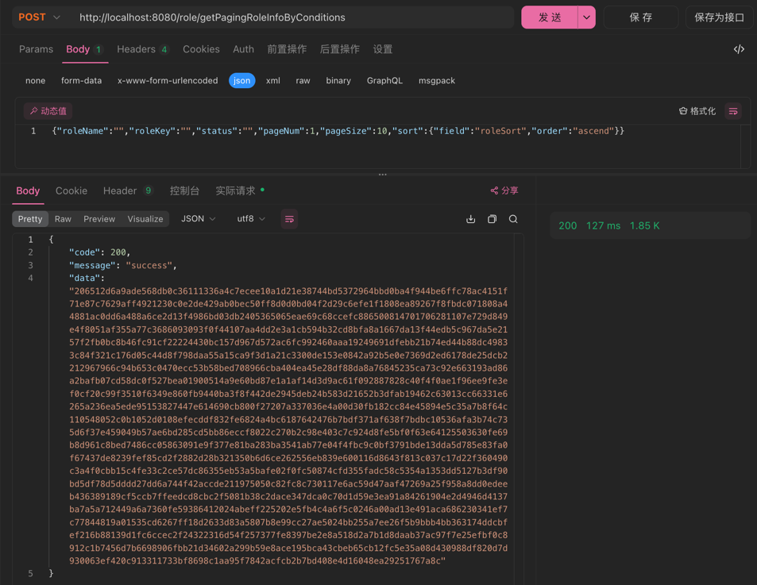
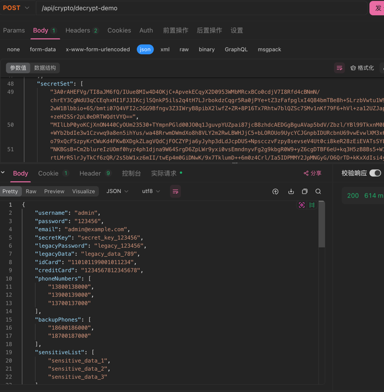
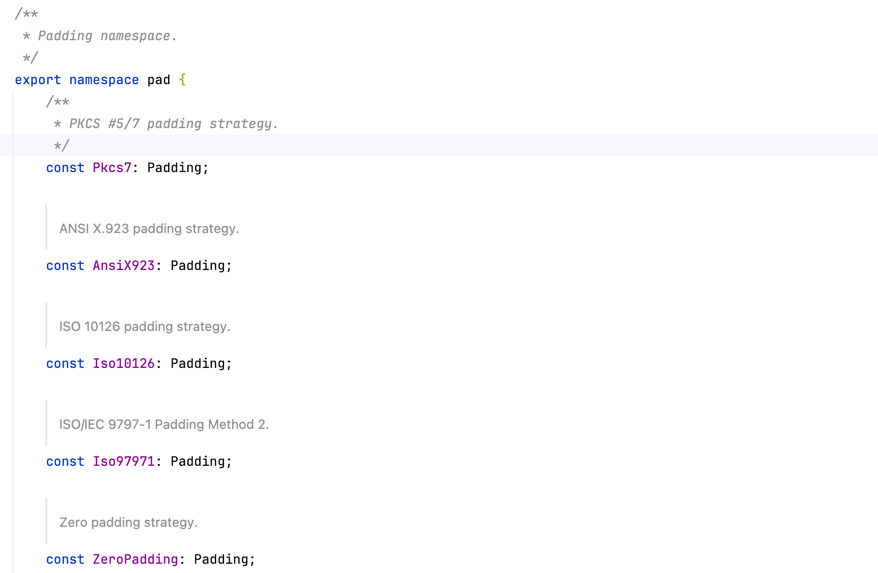

# 🌨️ winter-encrypt-spring-boot-starter

<div align="center">

[](https://www.apache.org/licenses/LICENSE-2.0.html)
[](https://openjdk.java.net/)
[](https://spring.io/projects/spring-boot)
[](https://search.maven.org/artifact/io.github.hahaha-zsq/winter-encrypt-spring-boot-starter)
[](https://github.com/hahaha-zsq/winter-encrypt-spring-boot-starter)

</div>

> 🔐 一个开箱即用的 Spring Boot 加解密工具包，内置AES/DES/RSA加密算法，支持注解式加解密，提供安全的密钥配置方案，助力数据安全！

<p align="center">
  
  
  
  
  
  
</p>

## 📚 目录

- [✨ 特性亮点](#-特性亮点)
- [📦 快速开始](#-快速开始)
- [🏷️ 注解说明](#-注解说明)
- [🧰 工具类方法](#-工具类方法)
- [⚙️ 配置项说明](#-配置项说明)
- [🏗️ 架构设计](#-架构设计)
- [❓ 常见问题](#-常见问题)
- [🔒 安全说明](#-安全说明)
- [📄 更新日志](#-更新日志)
- [👥 贡献指南](#-贡献指南)
- [🔗 相关链接](#-相关链接)
- [📝 开源协议](#-开源协议)

---

## ✨ 特性亮点

- 🚀 **零配置自动装配**，即插即用
- 🔒 支持 **AES/DES/RSA** 等主流加密算法，满足不同场景需求（AES:128/192/256位，DES:64位，RSA:2048位+）
- 🏷️ **注解驱动**，`@Encrypt/@Decrypt/@FieldEncrypt/@FieldDecrypt` 一键加解密
- 🛡️ 支持**字段级精细化加解密**，灵活配置
- 📦 **集合类型全覆盖**，自动处理 List/Set/Map/Array 等容器
- 🔧 内置**多种加密模式**（ECB、CBC、CFB、OFB、CTR）和**填充方式**
- 🔍 **策略模式设计**，支持不同集合类型的自动识别和处理
- 🛠️ **丰富的工具类**，提供静态方法直接调用

---

## 🏗️ 架构设计

项目采用分层架构 + 策略模式设计，核心组件关系如下：

```mermaid
classDiagram
    class CryptoAspect {
        -CryptoProperties cryptoProperties
        -CryptoService cryptoService  
        -ContainerCryptoService containerCryptoService
        +encrypt(ProceedingJoinPoint)
        +decrypt(ProceedingJoinPoint)
        +processSymmetricEncryption(Field, Object, Object, FieldEncrypt)
        +processRsaEncryption(Field, Object, Object, FieldEncrypt)
    }
    
    class CryptoService {
        <<interface>>
        +encrypt(Mode, Padding, String, String, String, CryptoType)
        +decrypt(Mode, Padding, String, String, String, CryptoType)
        +encryptRsa(String, String, String)
        +decryptRsa(String, String, String)
    }
    
    class CryptoDefaultServiceImpl {
        +encrypt(Mode, Padding, String, String, String, CryptoType)
        +decrypt(Mode, Padding, String, String, String, CryptoType)
        +encryptRsa(String, String, String)
        +decryptRsa(String, String, String)
    }
    
    class ContainerCryptoService {
        -strategyFactory : ContainerCryptoStrategyFactory
        +encryptContainer(Object, CryptoService, FieldEncrypt, String, String)
        +decryptContainer(Object, CryptoService, FieldDecrypt, String, String)
        +encryptRsaContainer(Object, CryptoService, FieldEncrypt, String, String)
        +decryptRsaContainer(Object, CryptoService, FieldDecrypt, String, String)
        +isSupportedContainer(Object) : boolean
        +getStrategyType(Object) : CollectionStrategyType
    }
    
    class ContainerCryptoStrategyFactory {
        -strategies : Map<CollectionStrategyType, CollectionCryptoStrategy>
        +getStrategy(CollectionStrategyType) : CollectionCryptoStrategy
        +registerStrategy(CollectionStrategyType, CollectionCryptoStrategy)
    }
    
    class CollectionCryptoStrategy {
        <<interface>>
        +encrypt(Object, CryptoService, FieldEncrypt, String, String)
        +decrypt(Object, CryptoService, FieldDecrypt, String, String)
        +encryptRsa(Object, CryptoService, FieldEncrypt, String, String)
        +decryptRsa(Object, CryptoService, FieldDecrypt, String, String)
        +getStrategyName() : String
        +getStrategyType() : CollectionStrategyType
    }
    
    class AbstractCollectionCryptoStrategy {
        +encryptItem(Object, CryptoService, FieldEncrypt, String, String)
        +decryptItem(Object, CryptoService, FieldDecrypt, String, String)
        +encryptRsaItem(Object, CryptoService, String, String)
        +decryptRsaItem(Object, CryptoService, String, String)
        +isNullCollection(Object) : boolean
    }
    
    class ListCryptoStrategy {
        +encrypt(Object, CryptoService, FieldEncrypt, String, String)
        +decrypt(Object, CryptoService, FieldDecrypt, String, String)
        +getStrategyName() : String
        +getStrategyType() : CollectionStrategyType
    }
    
    class MapCryptoStrategy {
        +encrypt(Object, CryptoService, FieldEncrypt, String, String)
        +decrypt(Object, CryptoService, FieldDecrypt, String, String)
        +getStrategyName() : String
        +getStrategyType() : CollectionStrategyType
    }
    
    class SetCryptoStrategy {
        +encrypt(Object, CryptoService, FieldEncrypt, String, String)
        +decrypt(Object, CryptoService, FieldDecrypt, String, String)
        +getStrategyName() : String
        +getStrategyType() : CollectionStrategyType
    }
    

    
    class ArrayCryptoStrategy {
        +encrypt(Object, CryptoService, FieldEncrypt, String, String)
        +decrypt(Object, CryptoService, FieldDecrypt, String, String)
        +getStrategyName() : String
        +getStrategyType() : CollectionStrategyType
    }
    
    class CryptoProperties {
        -AesConfig aes
        -DesConfig des  
        -RsaConfig rsa
        -Boolean isPrint
        +getEncryptKey(CryptoType) : String
        +getDecryptKey(CryptoType) : String
        +getIv(CryptoType) : String
    }
    
    class RsaConfig {
        -String privateKey
        -String publicKey
        +getActualPrivateKey() : String
        +getActualPublicKey() : String
    }
    
    class CryptoUtil {
        +winterAesEncryptHex(...)
        +winterDesEncryptHex(...)
        +winterGenerateRsAKey()
        +winterRsAPublicKeyEncrypt(...)
        +winterEncryptKaiser(...)
        +winterDecryptKaiser(...)
    }
    
    class Encrypt {
        <<annotation>>
    }
    
    class Decrypt {
        <<annotation>>
    }
    
    class FieldEncrypt {
        <<annotation>>
        +CryptoType cryptoType()
        +Mode mode()
        +Padding padding()
    }
    
    class FieldDecrypt {
        <<annotation>>
        +CryptoType cryptoType()  
        +Mode mode()
        +Padding padding()
    }
    
    class CryptoAutoConfiguration {
        +getCryptoService() : CryptoService
        +cryptoAspect(...) : CryptoAspect
        +listCryptoStrategy() : ListCryptoStrategy
        +mapCryptoStrategy() : MapCryptoStrategy
        +setCryptoStrategy() : SetCryptoStrategy

        +arrayCryptoStrategy() : ArrayCryptoStrategy
        +containerCryptoStrategyFactory(...) : ContainerCryptoStrategyFactory
        +containerCryptoService(...) : ContainerCryptoService
    }
    
    CryptoService <|.. CryptoDefaultServiceImpl
    CollectionCryptoStrategy <|-- AbstractCollectionCryptoStrategy
    AbstractCollectionCryptoStrategy <|-- ListCryptoStrategy
    AbstractCollectionCryptoStrategy <|-- MapCryptoStrategy
    AbstractCollectionCryptoStrategy <|-- SetCryptoStrategy

    AbstractCollectionCryptoStrategy <|-- ArrayCryptoStrategy
    
    CryptoAspect --> CryptoService : 使用
    CryptoAspect --> CryptoProperties : 配置
    CryptoAspect --> ContainerCryptoService : 集合处理
    ContainerCryptoService --> ContainerCryptoStrategyFactory : 策略选择
    ContainerCryptoStrategyFactory --> CollectionCryptoStrategy : 管理策略
    CryptoProperties --> RsaConfig : 包含
    CryptoAutoConfiguration --> CryptoAspect : 创建
    CryptoAutoConfiguration --> CryptoService : 创建
    CryptoAutoConfiguration --> ContainerCryptoService : 创建
    CryptoAutoConfiguration --> ContainerCryptoStrategyFactory : 创建
    CryptoAutoConfiguration --> ListCryptoStrategy : 创建
    CryptoAutoConfiguration --> MapCryptoStrategy : 创建
    CryptoAutoConfiguration --> SetCryptoStrategy : 创建

    CryptoAutoConfiguration --> ArrayCryptoStrategy : 创建
    
    Encrypt <-- CryptoAspect : 处理
    Decrypt <-- CryptoAspect : 处理
    FieldEncrypt <-- CryptoAspect : 处理
    FieldDecrypt <-- CryptoAspect : 处理
```



> **架构亮点：**
>
> - **AOP切面处理** - 无侵入式自动加解密
> - **策略模式** - 支持不同集合类型的自动识别和处理
> - **工厂模式** - 统一管理各种加密策略
> - **模板方法模式** - 抽象基类提供通用加密解密逻辑
> - **自动配置** - Spring Boot自动装配，零配置使用
> - **多算法支持** - AES(128/192/256位)、DES(64位)、RSA(2048位+)

---

## 📦 快速开始

### 1️⃣ 引入依赖

```xml
<dependency>
    <groupId>io.github.hahaha-zsq</groupId>
    <artifactId>winter-encrypt-spring-boot-starter</artifactId>
    <version>0.0.32</version>
</dependency>
```

### 2️⃣ 配置 application.yml

```yaml
winter-crypto:
  aes:
    key: 346a3f9f4c1988cb7a507cc177923ac7
    iv: 1234567887654321
    auto-adjust-iv: true
  des:
    key: 12345678
    iv: 87654321
    auto-adjust-iv: true
  # RSA配置
  rsa:
    private-key: "MIIEvQIBADANBgkqhkiG9w0BAQEFAASCBKcwggSjAgEAAoIBAQD5h8hFPBgYCJaF/nN1uHwWhJG8jYJrHyx3yy0tb0Gnt3K+MWCmU8pnG5yhgiA3eIYdRIFA11oKH69lhxznWn+goT0upFhO/cfJiGRSqIoyrM3zhghV3XVa0wNi1MJpcK+2oSltjQwacYDHmgWcx1yD20Tfiv5IeFKaHYTOrtc1011A9lVdx5A3vw57DJl91l9jpeBR362cpUx3+vibtnRc9owNrIOdvyAJUgzkvDiF6b5WWrQus3RXdiBCQ+2e/c7dvUfJF3KOIbVlbIVy4JXzERjRsrmjJTMDGdeCDoZTZE/RDC49BS4wuo10u23buNg7VCowVdKxSEnhJe50Q+5BAgMBAAECggEANEq2N3weeHrkQHRQce0VZAqoF+F34UcJJJmZgBn+ok0ZaK4kWPbaRb1Nl7MTWUySnnOKurHmlpSJRzeHYRxf/qOLlMiwEO2x/pPsoj3bqD76cfw2pvff7gamgQGhNEN/L0Ca0/BpBumeWTX30yEcTC2ZQ1d3bmx4sv9Yo4+UXhzhUU95jPbVm2QBLN+eORN0slxTHF68LLB8dL1vemsM8IJAfLGkYHJkAYaqGY6JNhCgz2M6xKnlfqvlKAJQ2nDvbsMQG1l6tagPnX+Qhbly+I2KlUsptnAbilFfeaCYtdgCMPrcnIvyF4yrLa864QevdDULQyjuh+aqdPO8YQwPmQKBgQD9I1bVOupQrW9xUmVZEhuj3p2WjK05n3r4UUTBtsGFkmUD/mBUquOT3n8UCTIGj5l/elve7pFzgdO74ZU2DY7QFaCTlvTGH93tii48Q+Li1KXGwdJcVxYA+7YQn1hEq53AkaBT7+pTE0/YrbZBig7rw5ONQaBAGB8kmcg2C1C1LwKBgQD8WgBf4Yr/mfA95IdIT6nsbyFQDsC9Xb6uRVIKKVFmBSZogOL1wodchnuFUtK6K9AZR/TzcvhSUUPtrkV/X5gxE+SB0r6KABa5GhMwqq+MYpglm+dkPROFMSnPjZnXz1pymTVlB7eH4O9Ve9tMJqtxclZptM9pzHj9/jg6ubCXjwKBgEiFz2LXtjnW9o6o5JBYN8MDDHMNarOPlVN/NQuqqFb0UiyKvF6Fdx3uKMo8uDBZA8kZ7Sg5gUJud5LkVjNePwQurgqavRXmG1bqt8RcTqxd8AC5luMNsCgn9Uld3ZQO9usszZo+qguTBNU3L3gnbY7uQV++5YJ3ZrS9ujaBl2XRAoGAD+ImVeKfWhk5Wtvwe+evvVb9VMmo7gJhhxyL3mHdYrt+QGOkZW2aEYPRcIHXC6rITV8PFueso5nD2cj3TN4aeTRUVKuMHKmGxJ3UiWKk7AQkqXFXriJ+AQsoI405GrFNcxsblkFXFvFcfxftpKxmbByTPdIIoBMjpnEC3wdjCxcCgYEA4yRNes5Of3DISNnLwvkUX3keHwCMfdMupQmp6lxUDvNATKRRydCsTR8mOJ2I/qfUrvsiPziBsBhQxP8dX9XI/dpaFpuGJoO4j3LOG2C+Ty+RjUyfZcf2gYKoYYxj7fJrLXurabAEpkRf58WCVhmt7V/bxB+U0/7k8CmHQCqO4bk="
    public-key: "MIIBIjANBgkqhkiG9w0BAQEFAAOCAQ8AMIIBCgKCAQEA+YfIRTwYGAiWhf5zdbh8FoSRvI2Cax8sd8stLW9Bp7dyvjFgplPKZxucoYIgN3iGHUSBQNdaCh+vZYcc51p/oKE9LqRYTv3HyYhkUqiKMqzN84YIVd11WtMDYtTCaXCvtqEpbY0MGnGAx5oFnMdcg9tE34r+SHhSmh2Ezq7XNdNdQPZVXceQN78OewyZfdZfY6XgUd+tnKVMd/r4m7Z0XPaMDayDnb8gCVIM5Lw4hem+Vlq0LrN0V3YgQkPtnv3O3b1HyRdyjiG1ZWyFcuCV8xEY0bK5oyUzAxnXgg6GU2RP0QwuPQUuMLqNdLtt27jYO1QqMFXSsUhJ4SXudEPuQQIDAQAB"
  is-print: true
```

**🔐 密钥长度要求：**

| 算法 | 密钥长度 | IV长度 | 说明 |
|------|----------|--------|------|
| **AES** | 16/24/32字节 | 16字节 | 支持128/192/256位密钥 |
| **DES** | 8字节 | 8字节 | 64位密钥 |
| **RSA** | 2048位+ | 无需IV | 仅支持Base64格式 |

### 3️⃣ 开始使用

只需在需要加密的方法上添加 `@Encrypt` 注解，并在相应字段上添加 `@FieldEncrypt` 注解即可：

#### 🔒 完整加密示例

以下是一个覆盖所有场景的完整示例，展示了所有支持的加密算法、集合类型和配置：

```java
@RestController
@RequestMapping("/api/crypto")
public class CryptoDemoController {

    // 1. 完整加密响应示例
    @Encrypt
    @GetMapping("/encrypt-demo")
    public CryptoDemoVO getEncryptedData() {
        CryptoDemoVO demo = new CryptoDemoVO();
        // 基础字段
        demo.setUsername("admin");

        // 1. AES对称加密 - 不同模式
        demo.setPassword("123456");
        demo.setEmail("admin@example.com");
        demo.setSecretKey("secret_key_123456");

        // 2. DES对称加密 - 不同模式
        demo.setLegacyPassword("legacy_123456");
        demo.setLegacyData("legacy_data_789");

        // 3. RSA非对称加密
        demo.setIdCard("110101199001011234");
        demo.setCreditCard("1234567812345678");

        // 4. 集合类型加密 - List
        demo.setPhoneNumbers(Arrays.asList("13800138000", "13900139000", "13700137000"));
        demo.setBackupPhones(Arrays.asList("18600186000", "18700187000"));
        demo.setSensitiveList(Arrays.asList("sensitive_data_1", "sensitive_data_2", "sensitive_data_3"));

        // 5. 集合类型加密 - Map
        demo.setUserInfo(new HashMap<String, String>() {{
            put("email", "admin@example.com");
            put("address", "北京市朝阳区");
            put("phone", "13800138000");
        }});
        demo.setConfigInfo(new HashMap<String, String>() {{
            put("theme", "dark");
            put("language", "zh-CN");
            put("timezone", "Asia/Shanghai");
        }});
        demo.setSecretInfo(new HashMap<String, String>() {{
            put("api_key", "api_key_123456");
            put("secret_token", "secret_token_789");
            put("private_key", "private_key_abc");
        }});
        // 6. 集合类型加密 - Set
        demo.setPhoneSet(new HashSet<>(Arrays.asList("13800138000", "13900139000", "13700137000")));
        demo.setBackupSet(new HashSet<>(Arrays.asList("18600186000", "18700187000")));
        demo.setSecretSet(new HashSet<>(Arrays.asList("secret_item_1", "secret_item_2", "secret_item_3")));

        // 8. 集合类型加密 - Array
        demo.setAddresses(new String[]{"北京市朝阳区", "上海市浦东新区", "广州市天河区"});
        demo.setBackupAddresses(new String[]{"深圳市南山区", "杭州市西湖区"});
        demo.setSecretAddresses(new String[]{"secret_address_1", "secret_address_2", "secret_address_3"});
        return demo;
    }

    // 2. 完整解密请求示例
    @Decrypt
    @PostMapping("/decrypt-demo")
    public CryptoDemoRequest processDecryptedData(@RequestBody CryptoDemoRequest request) {
        // 所有标记了@FieldDecrypt的字段都已被自动解密
        return request;
    }
}
```

#### 📋 加密VO类定义

```java
@Data
public class CryptoDemoVO {
    // 基础字段
    private String username;

    // 1. AES对称加密 - 不同模式
    @FieldEncrypt(cryptoType = CryptoType.AES, mode = Mode.CBC, padding = Padding.PKCS5Padding)
    private String password;

    @FieldEncrypt(cryptoType = CryptoType.AES, mode = Mode.ECB, padding = Padding.PKCS5Padding)
    private String email;

    @FieldEncrypt(cryptoType = CryptoType.AES, mode = Mode.CFB, padding = Padding.NoPadding)
    private String secretKey;

    // 2. DES对称加密 - 不同模式
    @FieldEncrypt(cryptoType = CryptoType.DES, mode = Mode.CBC, padding = Padding.PKCS5Padding)
    private String legacyPassword;

    @FieldEncrypt(cryptoType = CryptoType.DES, mode = Mode.ECB, padding = Padding.PKCS5Padding)
    private String legacyData;

    // 3. RSA非对称加密
    @FieldEncrypt(cryptoType = CryptoType.RSA)
    private String idCard;

    @FieldEncrypt(cryptoType = CryptoType.RSA)
    private String creditCard;

    // 4. 集合类型加密 - List
    @FieldEncrypt(cryptoType = CryptoType.AES, mode = Mode.CBC)
    private List<String> phoneNumbers;

    @FieldEncrypt(cryptoType = CryptoType.DES, mode = Mode.ECB)
    private List<String> backupPhones;
    @FieldEncrypt(cryptoType = CryptoType.RSA)
    private List<String> sensitiveList;

    // 5. 集合类型加密 - Map
    @FieldEncrypt(cryptoType = CryptoType.AES, mode = Mode.CBC)
    private Map<String, String> userInfo;

    @FieldEncrypt(cryptoType = CryptoType.DES, mode = Mode.ECB)
    private Map<String, String> configInfo;

    @FieldEncrypt(cryptoType = CryptoType.RSA)
    private Map<String, String> secretInfo;

    // 6. 集合类型加密 - Set
    @FieldEncrypt(cryptoType = CryptoType.AES, mode = Mode.CBC)
    private Set<String> phoneSet;

    @FieldEncrypt(cryptoType = CryptoType.DES, mode = Mode.ECB)
    private Set<String> backupSet;

    @FieldEncrypt(cryptoType = CryptoType.RSA)
    private Set<String> secretSet;

    // 8. 集合类型加密 - Array
    @FieldEncrypt(cryptoType = CryptoType.AES, mode = Mode.CBC)
    private String[] addresses;

    @FieldEncrypt(cryptoType = CryptoType.DES, mode = Mode.ECB)
    private String[] backupAddresses;

    @FieldEncrypt(cryptoType = CryptoType.RSA)
    private String[] secretAddresses;
}
```

#### 🔓 解密Request类定义

```java
@Data
public class CryptoDemoRequest {
    // 基础字段
    private String username;

    // 1. AES对称解密 - 不同模式
    @FieldDecrypt(cryptoType = CryptoType.AES, mode = Mode.CBC, padding = Padding.PKCS5Padding)
    private String password;

    @FieldDecrypt(cryptoType = CryptoType.AES, mode = Mode.ECB, padding = Padding.PKCS5Padding)
    private String email;

    @FieldDecrypt(cryptoType = CryptoType.AES, mode = Mode.CFB, padding = Padding.NoPadding)
    private String secretKey;

    // 2. DES对称解密 - 不同模式
    @FieldDecrypt(cryptoType = CryptoType.DES, mode = Mode.CBC, padding = Padding.PKCS5Padding)
    private String legacyPassword;

    @FieldDecrypt(cryptoType = CryptoType.DES, mode = Mode.ECB, padding = Padding.PKCS5Padding)
    private String legacyData;

    // 3. RSA非对称解密
    @FieldDecrypt(cryptoType = CryptoType.RSA)
    private String idCard;

    @FieldDecrypt(cryptoType = CryptoType.RSA)
    private String creditCard;

    // 4. 集合类型解密 - List
    @FieldDecrypt(cryptoType = CryptoType.AES, mode = Mode.CBC)
    private List<String> phoneNumbers;

    @FieldDecrypt(cryptoType = CryptoType.DES, mode = Mode.ECB)
    private List<String> backupPhones;
    @FieldDecrypt(cryptoType = CryptoType.RSA)
    private List<String> sensitiveList;

    // 5. 集合类型解密 - Map
    @FieldDecrypt(cryptoType = CryptoType.AES, mode = Mode.CBC)
    private Map<String, String> userInfo;

    @FieldDecrypt(cryptoType = CryptoType.DES, mode = Mode.ECB)
    private Map<String, String> configInfo;

    @FieldDecrypt(cryptoType = CryptoType.RSA)
    private Map<String, String> secretInfo;

    // 6. 集合类型解密 - Set
    @FieldDecrypt(cryptoType = CryptoType.AES, mode = Mode.CBC)
    private Set<String> phoneSet;

    @FieldDecrypt(cryptoType = CryptoType.DES, mode = Mode.ECB)
    private Set<String> backupSet;

    @FieldDecrypt(cryptoType = CryptoType.RSA)
    private Set<String> secretSet;

    // 8. 集合类型解密 - Array
    @FieldDecrypt(cryptoType = CryptoType.AES, mode = Mode.CBC)
    private String[] addresses;

    @FieldDecrypt(cryptoType = CryptoType.DES, mode = Mode.ECB)
    private String[] backupAddresses;

    @FieldDecrypt(cryptoType = CryptoType.RSA)
    private String[] secretAddresses;
}
```

---

## 🏷️ 注解说明

### 核心注解

| 注解 | 作用范围 | 主要功能 | 典型用法 |
|------|----------|----------|----------|
| `@Encrypt` | 方法级别 | 触发加密流程，拦截返回对象 | Controller方法返回值加密 |
| `@Decrypt` | 方法级别 | 触发解密流程，拦截方法参数 | Controller方法参数解密 |
| `@FieldEncrypt` | 字段级别 | 指定字段加密及加密策略 | VO字段标记 |
| `@FieldDecrypt` | 字段级别 | 指定字段解密及解密策略 | DTO字段标记 |

### 注解参数说明

#### @FieldEncrypt / @FieldDecrypt 参数

| 参数 | 类型 | 默认值 | 说明 | 可选值 |
|------|------|--------|------|--------|
| `cryptoType` | `CryptoType` | `AES` | 加密算法类型 | AES, DES, RSA |
| `mode` | `Mode` | `CBC` | 加密模式 | ECB, CBC, CFB, OFB, CTR |
| `padding` | `Padding` | `PKCS5Padding` | 填充方式 | PKCS5Padding, NoPadding, ISO10126Padding 等 |

### 使用组合示例

```java 
// AES + CBC模式 + PKCS5填充
@FieldEncrypt(cryptoType = CryptoType.AES, mode = Mode.CBC, padding = Padding.PKCS5Padding)
private String sensitiveData;

// RSA非对称加密 
@FieldEncrypt(cryptoType = CryptoType.RSA)
private String secretInfo;

// DES + ECB模式
@FieldEncrypt(cryptoType = CryptoType.DES, mode = Mode.ECB)
private String legacyData;
```

---


---


---

## ⚙️ 配置项说明

### 基础配置

| 配置项 | 说明 | 是否必填 | 默认值 | 长度要求 |
|-------|------|---------|-------|---------|
| `winter-crypto.aes.key` | AES密钥 | ✅ | - | 16/24/32字节（128/192/256位） |
| `winter-crypto.aes.iv` | AES初始化向量 | ✅ | - | 16字节（128位） |
| `winter-crypto.aes.auto-adjust-iv` | 是否自动调整AES IV长度 | ❌ | true | - |
| `winter-crypto.des.key` | DES密钥 | ✅ | - | 8字节（64位） |  
| `winter-crypto.des.iv` | DES初始化向量 | ✅ | - | 8字节（64位） |
| `winter-crypto.des.auto-adjust-iv` | 是否自动调整DES IV长度 | ❌ | true | - |
| `winter-crypto.rsa.private-key` | RSA私钥（Base64格式） | ✅ | - | 2048位+ |
| `winter-crypto.rsa.public-key` | RSA公钥（Base64格式） | ✅ | - | 与私钥匹配 |
| `winter-crypto.is-print` | 是否打印banner | ❌ | true | - |

### RSA安全配置

| 配置项 | 说明 | 是否必填 | 默认值 | 格式要求 |
|-------|------|---------|-------|---------|
| `winter-crypto.rsa.private-key` | RSA私钥内容（Base64格式） | ✅ | - | 纯Base64编码，2048位+ |
| `winter-crypto.rsa.public-key` | RSA公钥内容（Base64格式） | ✅ | - | 纯Base64编码，与私钥匹配 |

> ⚠️ **安全提示**：
> - 生产环境建议使用环境变量方式配置密钥
> - 定期轮换密钥，提高系统安全性

---

## 🧰 工具类方法

`CryptoUtil` 工具类提供丰富的加解密静态方法，支持直接调用：

### 对称加密方法

| 方法名 | 说明 | 返回类型 | 典型场景 | 密钥要求 |
|--------|------|----------|----------|----------|
| `winterGenerateKey()` | 随机生成AES密钥 | `byte[]` | 动态密钥生成 | 16字节（128位） |
| `winterAesEncryptHex(...)` | AES加密（多模式支持） | `String` | 数据加密传输 | 16/24/32字节密钥 |
| `winterAesDecryptStr(...)` | AES解密（多模式支持） | `String` | 数据解密还原 | 16/24/32字节密钥 |
| `winterDesEncryptHex(...)` | DES加密（多模式支持） | `String` | 兼容老系统 | 8字节密钥 |
| `winterDesDecryptStr(...)` | DES解密（多模式支持） | `String` | 数据解密还原 | 8字节密钥 |

### 非对称加密方法

| 方法名 | 说明 | 返回类型 | 典型场景 | 密钥要求 |
|--------|------|----------|----------|----------|
| `winterGenerateRsAKey()` | 生成RSA公私钥对（Base64格式） | `Map<String, String>` | 密钥对生成 | 2048位密钥对 |
| `rsaEncryptToBase64(...)` | RSA公钥加密 | `String` | 数据安全传输 | 2048位+公钥 |
| `rsaDecryptFromBase64(...)` | RSA私钥解密 | `String` | 数据解密 | 2048位+私钥 |

### 凯撒密码方法

| 方法名 | 说明 | 返回类型 | 典型场景 |
|--------|------|----------|----------|
| `winterEncryptKaiser(...)` | 凯撒密码加密 | `String` | 简单数据混淆 |
| `winterDecryptKaiser(...)` | 凯撒密码解密 | `String` | 数据还原 |

### 使用示例

```java
// 1. 生成RSA密钥对（返回Base64格式）
Map<String, String> keyPair = CryptoUtil.winterGenerateRsAKey();
String privateKey = keyPair.get("privateKey"); // Base64格式
String publicKey = keyPair.get("publicKey");   // Base64格式

// 2. AES加密/解密
String encrypted = CryptoUtil.winterAesEncryptHex(Mode.CBC, Padding.PKCS5Padding, 
    "mykey".getBytes(), "myiv".getBytes(), "hello world");
String decrypted = CryptoUtil.winterAesDecryptStr(Mode.CBC, Padding.PKCS5Padding,
    "mykey".getBytes(), "myiv".getBytes(), encrypted);

// 3. RSA加密/解密
String rsaEncrypted = CryptoUtil.rsaEncryptToBase64("sensitive data", publicKey);
String rsaDecrypted = CryptoUtil.rsaDecryptFromBase64(rsaEncrypted, privateKey);

// 4. 凯撒密码加密/解密
String kaiserEncrypted = CryptoUtil.winterEncryptKaiser("hello", 3);
String kaiserDecrypted = CryptoUtil.winterDecryptKaiser(kaiserEncrypted, 3);
```

---

## ❓ 常见问题

<details>
<summary><b>Q: @Encrypt 和 @FieldEncrypt 有什么联系？</b></summary>

**A:** 两个注解配合使用，实现精确的字段级加密：

| 注解 | 作用范围 | 主要功能 | 典型用法 |
|------|----------|----------|----------|
| `@Encrypt` | 方法级别 | 触发加密流程，拦截返回对象 | Controller方法 |
| `@FieldEncrypt` | 字段级别 | 指定字段加密及加密策略 | DTO/VO字段 |

**工作流程：**
1. `@Encrypt` 注解的方法被调用时，AOP切面拦截返回对象
2. 切面遍历对象所有字段，查找 `@FieldEncrypt` 注解
3. 只有被 `@FieldEncrypt` 标记的字段才会被加密
4. 根据 `@FieldEncrypt` 的参数选择加密算法、模式、填充方式

</details>

<details>
<summary><b>Q: 如何处理集合类型字段？</b></summary>

**A:** 项目支持多种集合类型的自动加解密：

**支持的集合类型：**
- **List**: ArrayList 等
- **Set**: HashSet 等  
- **Map**: HashMap 等

- **Array**: 一维数组

**使用示例：**
```java
@Data
public class UserVO {
    // List集合 - 自动加密列表中每个字符串元素
    @FieldEncrypt(cryptoType = CryptoType.AES)
    private List<String> phoneNumbers;
    
    // Map集合 - 自动加密Map中的值（不加密key）
    @FieldEncrypt(cryptoType = CryptoType.DES)  
    private Map<String, String> userInfo;
    
    // 数组 - 自动加密数组中每个元素
    @FieldEncrypt(cryptoType = CryptoType.RSA)
    private String[] sensitiveData;
}
```

**处理机制：**
- 系统会自动识别集合类型，选择对应的处理策略
- 只加密集合中的字符串元素，不支持嵌套对象加密
- 只加密标记了 `@FieldEncrypt` 的字段，其他字段保持不变

</details>

<details>
<summary><b>Q: 如何安全地配置RSA密钥？</b></summary>

**A:** 目前支持直接配置方式，建议在生产环境中使用环境变量：

**直接配置方式：**
```yaml
winter-crypto:
  rsa:
    private-key: "MIIEvQIBADANBgkqhkiG9w0BAQEFAASCB..."
    public-key: "MIIBIjANBgkqhkiG9w0BAQEFAAOCAQ8AMI..."
```

**安全最佳实践：**
- ✅ 生产环境建议使用环境变量
- ✅ 定期轮换密钥
- ❌ 禁止将密钥提交到版本控制系统

</details>

<details>
<summary><b>Q: 启动时报"密钥格式不正确"错误？</b></summary>

**A:** 请检查以下几个方面：

**1. 密钥格式要求：**
- **AES**: 密钥长度16/24/32字节（128/192/256位），IV长度16字节（128位）
- **DES**: 密钥长度8字节（64位），IV长度8字节（64位）  
- **RSA**: 仅支持Base64格式（纯Base64编码），密钥长度2048位+

**2. 常见错误和解决方案：**

```yaml
# ❌ 错误：AES密钥长度不符合要求
winter-crypto:
  aes:
    key: "123456"  # 只有6字节，应该是16/24/32字节

# ✅ 正确：AES密钥长度符合要求  
winter-crypto:
  aes:
    key: "1234567890123456"  # 16字节
```

**3. IV自动调整功能：**
```yaml
winter-crypto:
  aes:
    auto-adjust-iv: true   # 自动调整IV长度（推荐）
    auto-adjust-iv: false  # 严格验证IV长度
```

**4. 使用工具生成标准密钥：**
```java
// 生成AES密钥（16字节）
byte[] aesKey = CryptoUtil.winterGenerateKey();

// 生成RSA密钥对（Base64格式，2048位）
Map<String, String> rsaKeys = CryptoUtil.winterGenerateRsAKey();
```


</details>

<details>
<summary><b>Q: 如何自定义加密算法？</b></summary>

**A:** 目前不支持自定义加密策略。项目使用固定的加密实现，不支持扩展自定义加密算法。


</details>

<details>
<summary><b>Q: 是否支持嵌套对象加密？</b></summary>

**A:** 目前不支持嵌套对象加密。系统只支持以下加密场景：

**✅ 支持的情况：**
- 字符串字段加密
- 集合中的字符串元素加密（List<String>、Set<String>、Map<String, String>等）
- 数组中的字符串元素加密（String[]）

**❌ 不支持的情况：**
- 嵌套对象字段加密（如 `UserVO user`）
- 集合中的对象元素加密（如 `List<UserVO>`、`Map<String, UserVO>`）
- 复杂嵌套结构加密

**示例：**
```java
@Data
public class UserVO {
    private String username;
    
    // ✅ 支持：字符串字段加密
    @FieldEncrypt(cryptoType = CryptoType.AES)
    private String password;
    
    // ✅ 支持：字符串集合加密
    @FieldEncrypt(cryptoType = CryptoType.AES)
    private List<String> phoneNumbers;
    
    // ❌ 不支持：对象字段加密
    // @FieldEncrypt(cryptoType = CryptoType.AES)
    // private AddressVO address;
    
    // ❌ 不支持：对象集合加密
    // @FieldEncrypt(cryptoType = CryptoType.AES)
    // private List<AddressVO> addresses;
}
```

</details>

<details>
<summary><b>Q: 前端如何配合进行加解密？</b></summary>

**A:** 推荐使用 `crypto-js` 库：

**安装依赖：**
```bash
npm install crypto-js
```

**前端加解密工具：**
```typescript
import CryptoJS from 'crypto-js';

export const cryptoConfig = {
    key: "1234567890123456",  // 与后端配置保持一致
    iv: "1234567890123456"    // 与后端配置保持一致
};

/**
 * AES加密
 */
export const encryptAes = (plainText: string): string => {
    const key = CryptoJS.enc.Utf8.parse(cryptoConfig.key);
    const iv = CryptoJS.enc.Utf8.parse(cryptoConfig.iv);
    
    const encrypted = CryptoJS.AES.encrypt(plainText, key, {
        iv: iv,
        mode: CryptoJS.mode.CBC,
        padding: CryptoJS.pad.Pkcs7
    });
    
    return encrypted.ciphertext.toString(CryptoJS.enc.Hex);
};

/**
 * AES解密
 */
export const decryptAes = (encryptedHex: string): string => {
    const key = CryptoJS.enc.Utf8.parse(cryptoConfig.key);
    const iv = CryptoJS.enc.Utf8.parse(cryptoConfig.iv);
    
    const encryptedHexStr = CryptoJS.enc.Hex.parse(encryptedHex);
    const encryptedBase64 = CryptoJS.enc.Base64.stringify(encryptedHexStr);
    
    const decrypted = CryptoJS.AES.decrypt(encryptedBase64, key, {
        iv: iv,
        mode: CryptoJS.mode.CBC,
        padding: CryptoJS.pad.Pkcs7
    });
    
    return decrypted.toString(CryptoJS.enc.Utf8);
};
```

**使用示例：**
```typescript
// 前端发送加密数据
const loginData = {
    username: "admin",
    password: encryptAes("123456")  // 加密密码
};

// 接收后端加密响应并解密
const response = await fetch('/api/user');
const encryptedData = await response.json();
const decryptedData = decryptAes(encryptedData.data);
```

**注意事项：**
- 前后端密钥和IV必须保持一致
- `crypto-js` 中的 `Pkcs7` 对应 Java 中的 `PKCS5Padding`
- 确保前端密钥的安全存储（建议从服务端动态获取）

</details>

---

## 🔗 相关链接

- [📘 GitHub 仓库](https://github.com/hahaha-zsq/winter-encrypt-spring-boot-starter)
- [📚 Hutool 加密文档](https://hutool.cn/docs/#/crypto/)
- [🔧 Spring Boot 官方文档](https://spring.io/projects/spring-boot)
- [📦 Maven 中央仓库](https://search.maven.org/artifact/io.github.hahaha-zsq/winter-encrypt-spring-boot-starter)
---

## 📄 更新日志

### v0.0.32
- ✨ **重大安全改进**：新增RSA密钥安全配置方案
- 📝 全面优化文档，新增安全配置指南和最佳实践
- 🔧 改进异常处理机制，提供更清晰的错误信息

### v0.0.31
- 🎉 项目重构，采用策略模式设计
- ✨ 新增集合类型加解密支持（List、Set、Map、Array）
- 🏗️ 引入容器加密服务和策略工厂
- 🔧 优化自动配置机制

### v0.0.30
- ✨ 新增 `@Decrypt` 注解支持，实现请求参数自动解密
- ✨ 新增 `@FieldDecrypt` 注解，支持字段级解密配置
- 🔧 优化AOP切面逻辑，提升处理性能
- 📦 增强集合类型支持，完善策略模式实现

### v0.0.1  
- 🎉 首次发布
- ✨ 支持 `@Encrypt` 和 `@FieldEncrypt` 注解
- 🔒 集成 AES/DES/RSA 加密算法
- 🛡️ 支持多种加密模式和填充方式

---

## 👥 贡献指南

我们欢迎任何形式的贡献，无论是新功能、文档改进还是问题修复！

### 如何贡献

1. **Fork 本仓库** 到你的 GitHub 账号
2. **创建特性分支** (`git checkout -b feature/amazing-feature`)
3. **提交更改** (`git commit -m 'Add some amazing feature'`)
4. **推送到分支** (`git push origin feature/amazing-feature`)
5. **创建 Pull Request**

### 贡献类型

- 🐛 **Bug修复** - 修复现有功能中的问题
- ✨ **新功能** - 添加全新的功能特性
- 📝 **文档** - 改进文档或添加示例
- 🔧 **优化** - 改进现有功能但不添加新功能  
- 🧪 **测试** - 添加或修改测试用例
- 🔒 **安全** - 安全相关的改进

### 开发规范

- 遵循现有的代码风格和命名规范
- 为新功能添加相应的单元测试
- 更新相关文档和示例
- 确保所有测试通过

### Issue 模板

**Bug 报告：**
- 环境信息（Java版本、Spring Boot版本等）
- 重现步骤
- 期望行为 vs 实际行为
- 相关配置和错误日志

**功能请求：**
- 功能描述和使用场景
- 实现建议
- 相关资料链接

---

## 🔒 安全说明

### 🛡️ 密钥管理最佳实践

**生产环境密钥管理：**
- ✅ 使用环境变量或外部密钥管理系统
- ✅ 定期轮换密钥，建议周期不超过90天
- ✅ 使用不同环境的不同密钥（开发/测试/生产）
- ✅ 限制密钥访问权限，最小权限原则
- ❌ 绝不将密钥硬编码在代码中
- ❌ 避免在日志中输出密钥信息


### ⚠️ 已知限制

- 本工具包提供基础的加解密功能，不能替代专业的安全审计
- 对于高安全要求场景，建议结合多层安全措施
- RSA加密有数据长度限制，大数据建议使用混合加密
- 性能方面，RSA加密比对称加密慢，适合小数据量场景
- **不支持嵌套对象加密** - 只支持字符串字段和字符串集合加密
- **不支持自定义加密策略** - 使用固定的加密实现，不支持扩展


---

## 📝 开源协议

本项目采用 [Apache 2.0 许可证](https://www.apache.org/licenses/LICENSE-2.0.html) 进行许可。


---

<div align="center">

### 🌟 如果这个项目对你有帮助，请给个 Star ⭐

**让我们一起构建更安全的Java生态系统！**

[](https://star-history.com/#hahaha-zsq/winter-encrypt-spring-boot-starter&Date)

---

❤️ **感谢所有贡献者和支持者！** 

[📧 联系我们](mailto:your-email@example.com) | [💬 讨论区](https://github.com/hahaha-zsq/winter-encrypt-spring-boot-starter/discussions) | [🐛 问题反馈](https://github.com/hahaha-zsq/winter-encrypt-spring-boot-starter/issues)

</div>

