# 📦 GitHub Actions 自动发布 JAR 包流程指南

> 本文档为简体中文版本，详细介绍了使用 GitHub Actions 自动发布 JAR 包到 Maven 中央仓库的完整流程。

## 🔍 概述

本文档详细介绍了如何使用 GitHub Actions 自动将 Java 项目发布到 Maven 中央仓库的完整流程。通过本自动化流程，开发者只需执行本地的版本更新脚本并推送标签，即可触发远程构建和发布，无需手动执行繁琐的发布步骤。

## 🛠️ 前置准备

### 1️⃣ Maven 中央仓库账号
- 注册 Sonatype OSSRH 账号

### 2️⃣ GPG 密钥配置
- 生成 GPG 密钥对
- 将公钥发布到公共密钥服务器
- 保存私钥用于签名

### 3️⃣ GitHub 仓库设置
- 在仓库的 Settings > Secrets and variables > Actions 中添加以下密钥:
  - `OSSRH_USERNAME`: Sonatype 账号用户名
  - `OSSRH_PASSWORD`: Sonatype 账号密码
  - `GPG_PRIVATE_KEY`: GPG 私钥内容
  - `GPG_PASSPHRASE`: GPG 密钥密码

## 🔄 自动发布流程

### 步骤 1: 本地版本更新
1. 执行 `scripts/publish.sh` 脚本
2. 输入新的版本号
3. 脚本自动更新 `pom.xml` 中的版本号
4. 提交更改并推送到远程仓库
5. 创建并推送版本标签 (如 `v0.1.0`)

```bash
./scripts/publish.sh
# 输入版本号，如 0.1.0
```

### 步骤 2: GitHub Actions 触发构建
- 当检测到新的版本标签 (格式为 `v*`) 被推送时，自动触发工作流
- 工作流配置文件: `.github/workflows/maven-publish.yml`

### 步骤 3: 环境准备
- 检出代码
- 设置 JDK 环境
- 导入 GPG 密钥
- 配置 Maven 设置文件

### 步骤 4: 构建与发布
- 执行 Maven 部署命令
- 签名构建的 JAR 包
- 上传到 Sonatype OSSRH

### 步骤 5: 发布完成
- 构建的 JAR 包被自动发布到 Maven 中央仓库
- 通常需要几分钟到几小时不等，新版本才会在 Maven 中央仓库中可用

## 📊 工作流程图

```mermaid
flowchart LR
    A["📄 本地修改版本号"] -->|"执行 publish.sh"| B["🏷️ 推送标签 v*"]
    B --> C["🚀 触发 GitHub Actions"]
    C --> D["🔧 环境准备"]
    D --> E["📦 构建与签名"]
    E --> F["🌐 发布到Maven中央仓库"]
    
    style A fill:#d4f1f9,stroke:#05a,stroke-width:2px
    style B fill:#d5f5e3,stroke:#0a5,stroke-width:2px
    style C fill:#fcf3cf,stroke:#a50,stroke-width:2px
    style D fill:#fadbd8,stroke:#a05,stroke-width:2px
    style E fill:#e8daef,stroke:#50a,stroke-width:2px
    style F fill:#d6eaf8,stroke:#05a,stroke-width:2px
```



## ⚙️ 工作流配置详解

GitHub Actions 工作流配置文件 (`.github/workflows/maven-publish.yml`) 的主要组成部分:

### 触发条件
```yaml
on:
  push:
    tags:
      - 'v*'   # 只有推送版本标签时才触发
```

### 环境设置
```yaml
- name: Set up JDK
  uses: actions/setup-java@v4
  with:
    distribution: 'temurin'
    java-version: '8'
    cache: 'maven'
    gpg-private-key: ${{ secrets.GPG_PRIVATE_KEY }}
    gpg-passphrase: ${{ secrets.GPG_PASSPHRASE }}
```

### Maven 配置
```yaml
- name: Configure Maven settings.xml
  run: |
    mkdir -p ~/.m2
    cat > ~/.m2/settings.xml <<EOF
    <settings>
      <servers>
        <server>
          <id>dadandiaoming-maven</id>
          <username>${{ secrets.OSSRH_USERNAME }}</username>
          <password>${{ secrets.OSSRH_PASSWORD }}</password>
        </server>
      </servers>
    </settings>
    EOF
```

### 构建与发布
```yaml
- name: Build and Publish
  run: |
    GPG_KEY_ID=$(gpg --list-secret-keys --keyid-format LONG | grep sec | awk '{print $2}' | cut -d'/' -f2)
    mvn clean deploy -Dgpg.keyname=$GPG_KEY_ID -Dgpg.passphrase=${{ secrets.GPG_PASSPHRASE }} -DskipTests
```

## 📝 POM 文件配置

为了支持自动发布，`pom.xml` 文件需要包含以下关键配置:

### 1️⃣ 项目基本信息
- Group ID、Artifact ID、Version
- Name、Description、URL
- License 信息
- Developer 信息
- SCM 信息

### 2️⃣ 发布插件配置
- `central-publishing-maven-plugin`: 用于发布到 Maven 中央仓库
- `maven-source-plugin`: 生成源代码 JAR
- `maven-javadoc-plugin`: 生成 JavaDoc JAR
- `maven-gpg-plugin`: 对构建产物进行 GPG 签名

## ❓ 常见问题

### 1. 发布失败怎么办?
- 检查 GitHub Actions 日志了解具体错误
- 确认所有密钥是否正确配置
- 验证 pom.xml 是否包含所有必要信息

### 2. 多久能在 Maven 中央仓库看到新版本?
- 通常需要几分钟到几小时不等
- 可以在 https://central.sonatype.com/ 查看发布状态

### 3. 如何撤回已发布的版本?
- Maven 中央仓库不支持删除已发布的版本
- 可以发布新版本来替代有问题的版本

## 🔗 相关资源

- [Sonatype OSSRH 指南](https://central.sonatype.org/publish/publish-guide/)
- [GitHub Actions 文档](https://docs.github.com/cn/actions)
- [Maven GPG 插件文档](https://maven.apache.org/plugins/maven-gpg-plugin/)
